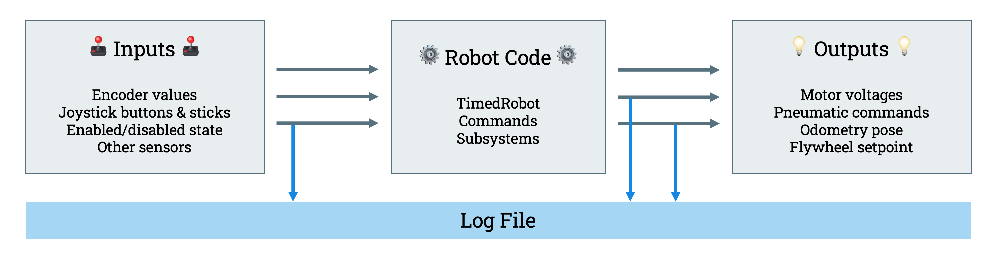

# What is Data Logging?

Data logging is a process which takes every (logged) variable/information about the robot and writes it to a log file on a USB stick connected to the RoboRIO.

For example, an arm subsystem would include logged data of motor temperature, motor voltage, motor current, and arm position. This data can then be reviewed by a program or manually analyzed. Data logging is used to isolate **software** issues but can also be used to isolate **mechanical** issues.

## AdvantageKit

[AdvantageKit](https://docs.advantagekit.org) is a data logging software that we use, developed by [Team 6328](https://www.thebluealliance.com/team/6328). You can learn more about what AdvantageKit is [here](https://docs.advantagekit.org). This streamlines data logging and provides good structure for [Robot Simulation](/docs/Simulation/Intro).

 

AdvantageKit works by splitting your subsystem into different layers across multiple files. You have the IO layer, which involves **all** data that needs to be logged and **all** data needed for the *logic layer*. The logic layer works by taking the data from the IO layer and handling all of the processing and logic. This handles all of your commands as these are logic-based. More in-depth documentation can be found [here](https://docs.advantagekit.org).