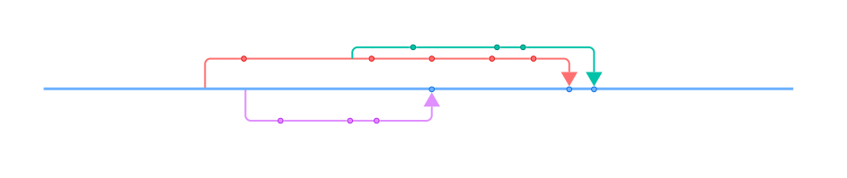
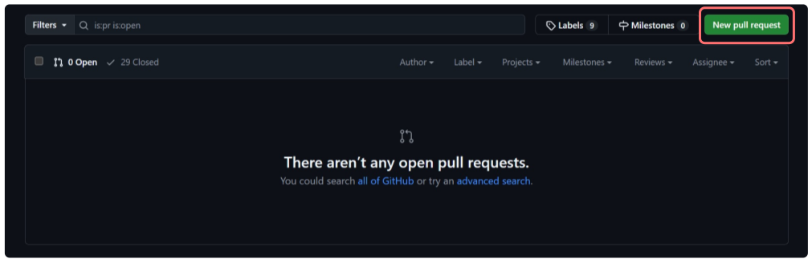
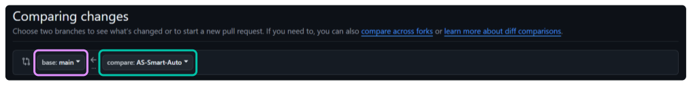
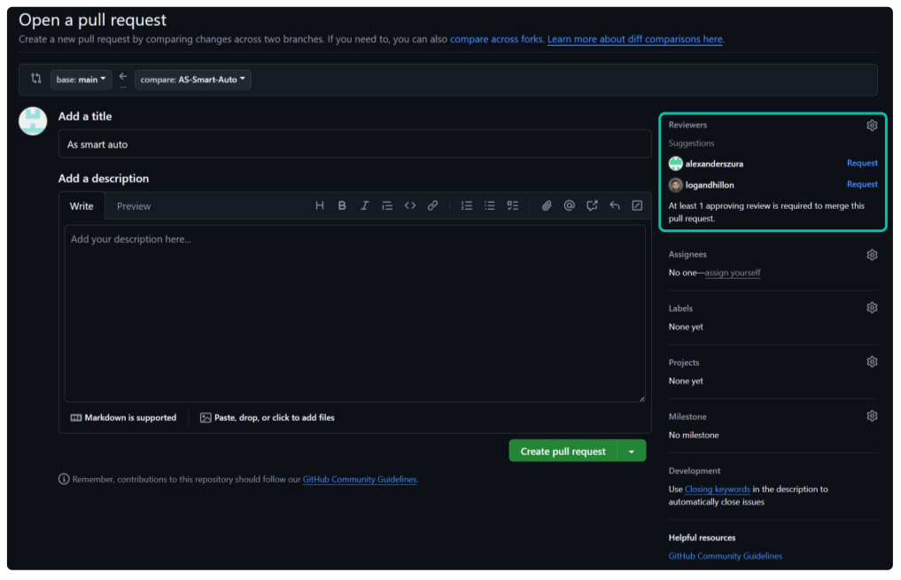

In simple terms, you can think of branches as a copy of the repository (or another branch) at a certain point that is then seperated from the original branch. This allows you to work on individual features or fixes in isolation, without having to worry about other changes conflicting with your work. While utilizing branches is always great practice even with individual/personal repositories, they are especially powerful when working in a team! 

## Branching Workflow


As shown in the flow chart above, a 4 stage workflow is used when implemengint new features or fixing issues. Once a branch is created and the required changes are made, the developer can innitiate a pull request. The pull request must then be reviewed and approved by another member of the programming team before it is pushed into main. As a general rule of thumb, all new features or changes to code must be tested on the robot before being pulled into main.

:::info
In order to keep things organized, all branches in the robot repo should follow the following naming convention: 

```<Initials>-<Component Name>```

**For Example:**
- FD-vision
- AS-indexer
- JL-drivetrain
- LN-shooterCommand
:::

## Creating Pull Requests



A pull request can be created by navigating to the **Pull requests** tab under the repository page as shown above. Altneratively you can also innitiate the pull request via github desktop.


When creating a pull request, you will be given the option to pick the **<span style={{ color: "#e08fff" }}>target branch</span>** that you would like your **<span style={{ color: "#62bea9" }}>current branch</span>** to be merged into. Once you have ensured that the appropriate branches are selected, you can go ahead and create the pull request.


The last steps are to create a suitable title, and to **<span style={{ color: "#62bea9" }}>assign a reviewer</span>**. Note that you do not have to write a description for the pull request as it is typically automatically populated from the commit history once the pull request is innitiated.

:::info
Once the pull request has been approved, you typically 3 options to pick between when merging the branch. Those being **merge commit**, **squash and merge**, and **rebase and merge**. In most cases, when working on the robot repository you should be using **squash and merge**.
:::


:::tip
Before creating a pull request, pull the latest changes from the target branch in order to This is ensure that no merge conflicts will occur. Remember to also test your code once again after doing so as changes brought in from any other branch could cause unexpected errors.
:::