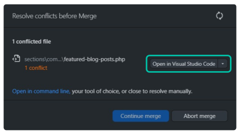
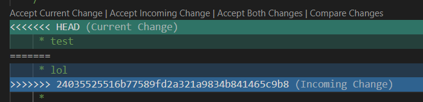

import Tabs from '@theme/Tabs';
import TabItem from '@theme/TabItem';

When multiple people are collaborating in a repository, it is not uncommon for **merge conflicts** to occure. This can happen when two different users try to push changes to the same piece of code as Git gets confused as to which of the two it should keep! This can be manually resolved by telling Git what it should keep as shown in the example below. 

:::info
As a general rule of thumb, in order to mitigate merge conflcits, you should always **git pull** before beginning to make changes. Sometimes changes can be made while you are actively working on the branch/repository so you should also be pulling the latest changes before trying to make a push.
:::

## Resolving Merge Conflicts
When merge conflicts occur, you will be presented with the following popup. Select **Open in Visual Studio Code** to resolve the conflict.

You should see two different highlighted sections for each conflict. The green portion represents the **current change** you want to push while the blue portion represents the **incoming change** from the other user. You are given the option to choose between the two or both depending on what fits best for the given conflict. Additionally, you can also make manual changes to the code if required.

## Group Activity
<Tabs>
    <TabItem value="setep1" label="1. Create a commit" default>
        ### Clone repository
        In order to participate in this activity, you must first clone the following [repository](placeholder.com). 

        ### Create a commit
        Make any changes you'd like to the code provided and create a commit. **DO NOT PUSH YET!**
    </TabItem>

    <TabItem value="setep2" label="2. Conflict mayham" default>
    Try pushing your code at the same time as everyone else. Changes are, you're going to experience a merge conflict. Try resolving the conflicts as shown above and push your changes!
    </TabItem>
</Tabs>