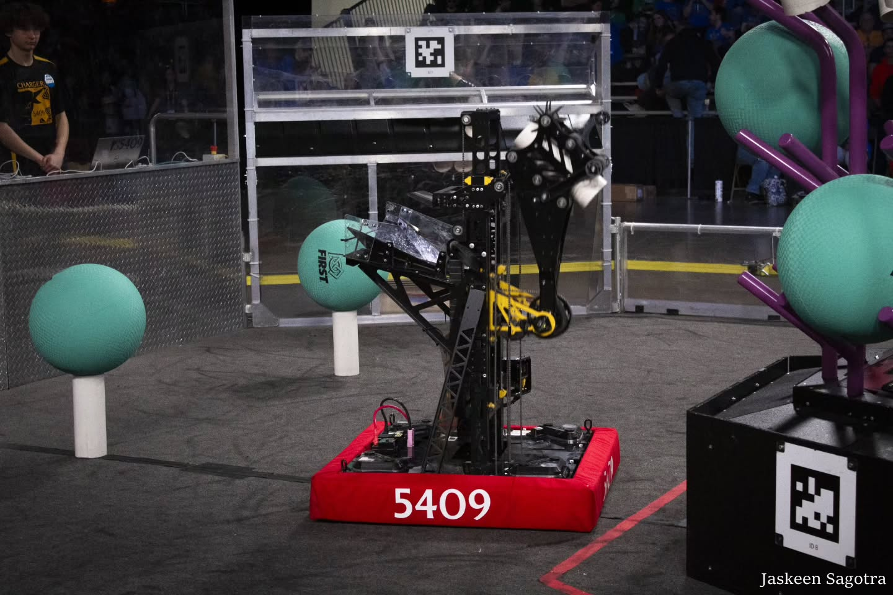

## About the Season

The [2025 FRC game *REEFSCAPE*](https://www.youtube.com/watch?v=YWbxcjlY9JY) was ocean-themed, where robots placed Coral onto a Reef structure and managed Algae to score points. Our robot focused strictly on scoring Coral quickly and accurately across all levels of the Reef.

## Software & Hardware Overview

### Hardware:

- 8 KrakenX60s & 4 CANCoders for the swerve modules
- 1 Pigeon 2.0 gyro
- 1 Limelight 4 + Hailo-8 upgrade for AprilTag localization
- 2 Falcon 500s for controlling the elevator
- 1 KrakenX60 for controlling the pivot
- 1 Falcon 500 for the rollers on end effector
- 1 ToF sensor for detecting game piece in end effector
- 1 CANCoder for absolute position of the pivot

 

### Software:
- [PathPlanner](https://pathplanner.dev) for path following routines
- [SysID](https://docs.wpilib.org/en/stable/docs/software/advanced-controls/system-identification/introduction.html) for auto tuning
- [MegaTag2](https://docs.limelightvision.io/docs/docs-limelight/pipeline-apriltag/apriltag-robot-localization-megatag2) for localization accuracy improvements
- Drive motors FOC Current Velocity PID control
- Phoenix Pro certified for CTRE products
- Data Logging through [AdvantageKit](https://docs.advantagekit.org)
- Accurate Robot Simulation through [MapleSim](https://shenzhen-robotics-alliance.github.io/maple-sim/), visualized using [AdvantageScope](https://docs.advantagescope.org)
- Custom auto align using a custom PID controller with acceleration and velocity constraints to ensure accurate and efficient scoring
- Fused CANCoder on swerve modules and pivot for increased accuracy and lower latency