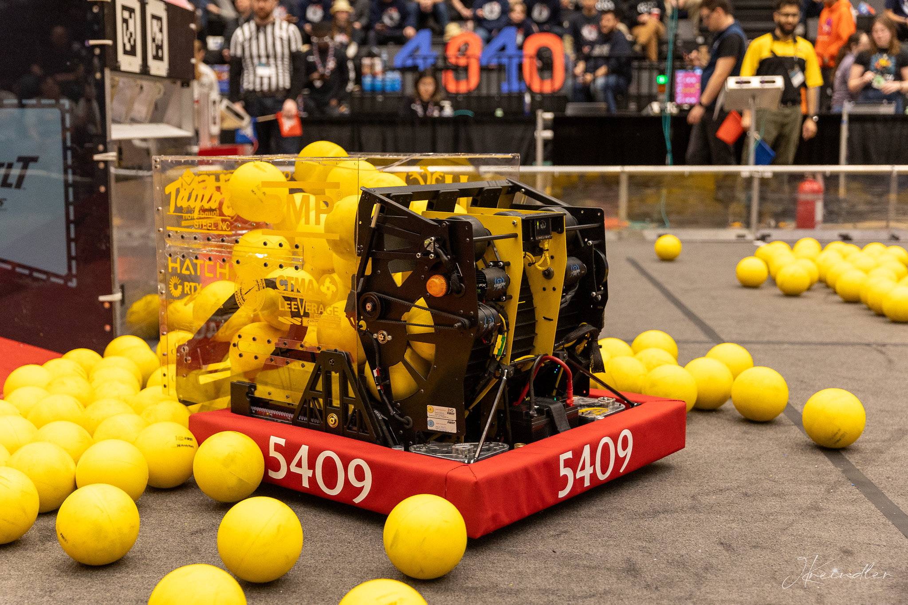

## About the Season

The [2026 FRC game *REBUILT*](https://www.youtube.com/watch?v=YWbxcjlY9JY) was archaeology-themed, where robots scored FUEL
into their HUB and climbed a TOWER to score points.

Originally, Hydra focused on both climbing and scoring fuel, however, we pivoted to focusing solely on scoring
fuel to maximize performance.

## Software & Hardware Overview

### Hardware:

- 4 Kraken X60(S)s, 4 Kraken X60s, and 4 CANCoders for the swerve modules
- 1 Pigeon 2.0 gyro
- 1 RoboRIO 2.0
- 1 radio
- 1 main breaker
- 2 mini power modules
- 1 RSL
- 1 Limelight 4 for AprilTag localization
- 2 Kraken X60s for the launcher flywheels
- 1 CANCoder for launcher flywheel position tracking
- 1 Kraken X60 and 1 Kraken X44 for the launcher feeder
- 1 Kraken X44 for intake deployment
- 2 Kraken X60s for intake rollers
- 1 Kraken X44 for hopper deployment and parallelizer actuation
- 1 Kraken X60 for the parallelizer
- 2 linear actuators for the launcher hood

 

### Software:

- [PathPlanner](https://pathplanner.dev) for paths
    - Note: full autos were created programmatically by stringing multiple paths & commands together.
- [MegaTag2](https://docs.limelightvision.io/docs/docs-limelight/pipeline-apriltag/apriltag-robot-localization-megatag2)
  for vision, odometry, and localization accuracy improvements
- PID control & feed forwards for motor control
- Phoenix Pro certified for CTRE products
- Data Logging through [AdvantageKit](https://docs.advantagekit.org)
- Accurate Robot Simulation through [MapleSim](https://shenzhen-robotics-alliance.github.io/maple-sim/), visualized
  using [AdvantageScope](https://docs.advantagescope.org)
- System-wide logging for all subsystems via [AdvantageScope](https://docs.advantagescope.org)
- Custom auto align using a custom PID controller with acceleration and velocity constraints to ensure accurate and
  efficient scoring
- Fused CANCoder on swerve modules and pivot for increased accuracy and lower latency
