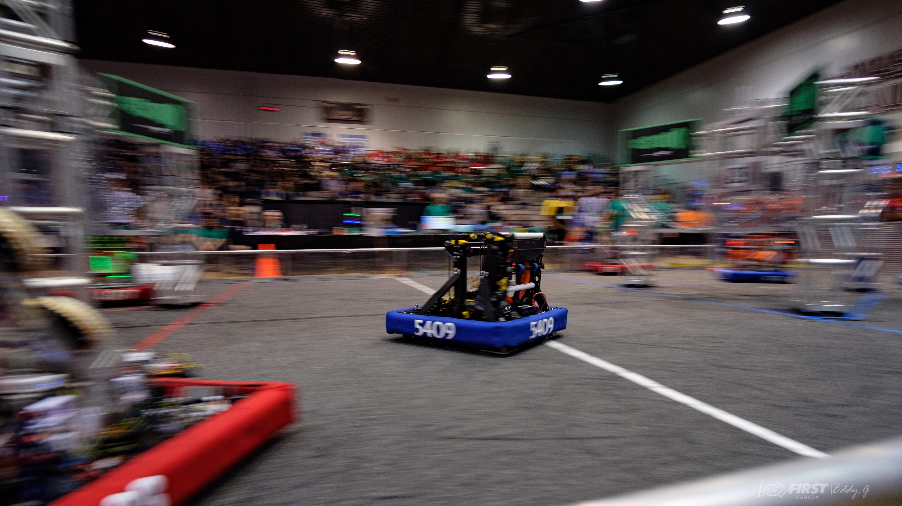

## About the Season

In the [2024 FRC game *CRESCENDO*](https://www.youtube.com/watch?v=9keeDyFxzY4), our robot focused on scoring Notes into the Amp for consistent cycle points and into the Trap during endgame for bonus points. We prioritized fast intake, quick Amp scoring, and reliable Trap climbs to maximize alliance scoring by aiding speaker scoring robots through *Amplifying*.

## Software & Hardware Overview

### Hardware:

- 2 Neo's for the elevator
- 1 Neo for the cartridge
- 1 Neo for the rollers on the cartridge
- 1 Neo for the intake
- 1 Neo for the indexer
- 8 Falcon500's & 4 cancoders for the swerve modules
- 1 Pigeon2.0 gyro
- 3 Ardu cams running on 2 orange pies for april tag localization
- 3 [IR Sensors](https://www.amazon.ca/Adjustable-Avoidance-Detection-Manufacturing-Automatic/dp/B0CRDBWZ5S) for detecting game pieces in robot

### Software:
- [Path Planner](pathplanner.dev) for auto routines
- [PhotonVision](https://photonvision.org) for april tag localization
- Drive motors voltage velocity PID control; through phoenix swerve gen
- Phoenix pro certified for CTRE products