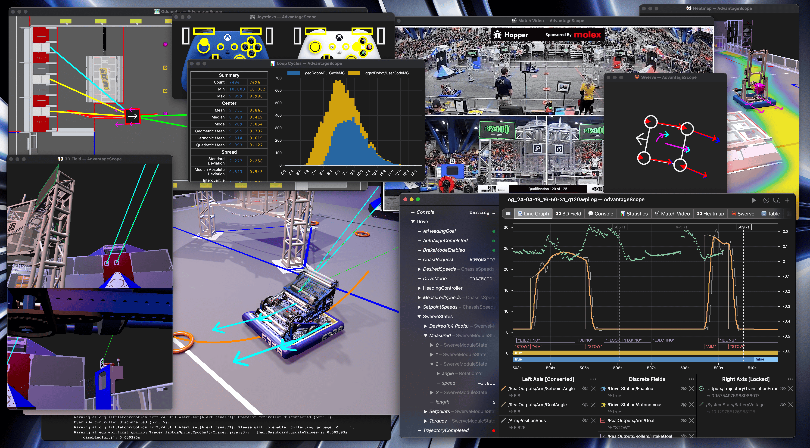

# What is Robot Simulation?
Robot Simulation is a **crucial** part of code development. It allows programmers to get a head start in programming the robot before actually having the robot. Robot Simulation is also a safe environment to test potentially *dangerous* code like automated commands. It is used to validate robot commands and actions where it is safe to make mistakes before putting them on a real robot.

:::tip
Before even knowing what the robots functions are you can start working on drive commands like auto align.
:::

# MapleSim
[MapleSim](https://shenzhen-robotics-alliance.github.io/maple-sim/) provides an extra layer to simulation. One of the key improvements is odometry simulation, including wheel slippage. This can also be used to simulate a vision subsystem to aid with resetting odometry position. It also provides collision detection with the field and opponent robots, which can be used for driver practice before having a real robot. There are many other cool features which you can check out in their [documentation](https://shenzhen-robotics-alliance.github.io/maple-sim/). There's also a championship conference presentation by [Team 4152](https://www.thebluealliance.com/team/4152) about MapleSim on [Chief Delphi](https://www.chiefdelphi.com/t/maple-sim-conference-team-4152-slides-and-video-release/500585).
:::caution
Last Validated in 2025
:::

# AdvantageScope

"AdvantageScope is a robot diagnostics, log review/analysis, and data visualization application for FIRST Robotics Competition teams developed by [Team 6328](https://www.littletonrobotics.org/)." It reads logs in WPILOG, DS log, Hoot (CTRE), and RLOG file formats, plus live robot data viewing using NT4 or RLOG streaming." - [AdvantageScope Documentation](https://docs.advantagescope.org/).

AdvantageScope provides a visualization of simulated or real data. It can be used to validate robot pose, mechanism positions, motor outputs, etc. The 3D Field tab can be used to validate different commands that use mechanisms. The 2D Field tab can be used to validate robot pose on the field and pathing for drive functions. Read more in the [AdvantageScope Documentation](https://docs.advantagescope.org/) for useful functions of the software.

:::tip
Create and save multiple layouts for AdvantageScope so that you can easily save and load them at a competition. Having "Simulation", "Log Replay", and "Live Robot" layouts are useful. 
:::